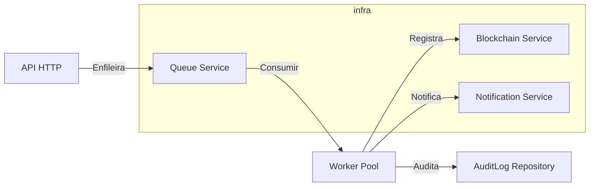

# Arquitetura do Projeto

Este documento descreve a arquitetura do projeto "Work_processamento_assincrono", explicando os principais componentes, responsabilidades e motivações por trás de cada escolha arquitetural.

---

## Visão Geral

O projeto está organizado com foco em separação de responsabilidades, testabilidade, e facilidade de manutenção. As principais camadas são:

- `cmd/` — Entrypoints da aplicação (API e worker).
- `internal/` — Código da aplicação dividido em subpacotes por domínio e infraestrutura.
- `pkg/` — Bibliotecas e utilitários reusáveis (ex.: logger).
- `config/` — Configuração central da aplicação.
- `api/` — Artefatos auxiliares para execução em container ou exemplos.

Essa separação segue boas práticas do ecossistema Go e do Clean Architecture, permitindo que regras de negócio fiquem isoladas de detalhes de infraestrutura.

## Componentes Principais

### `cmd/` (Entrypoints)

- `cmd/api/main.go`: inicia o servidor HTTP e registra rotas.
- `cmd/worker/worker.go`: inicia o processo worker que consome filas e processa transações assincronamente.

Motivação: manter os pontos de entrada separados facilita deploys independentes (por exemplo, deploy do API server e do worker em serviços distintos ou containers). Também simplifica testes e instrumentação.

### `config/` (Configuração)

- `config/config.go`: centraliza a leitura de variáveis de ambiente, timeouts e parâmetros de operação.

Motivação: centralizar configuração evita duplicação e facilita a gestão de diferentes ambientes (dev/staging/prod). Permite injeção de configurações em testes.

### `internal/domain` (Entidades de Domínio)

Contém definições de entidades como `transaction`, `user`, `audit_log`, `blockchain`, e `notification`.

Motivação: manter modelos de domínio puros e independentes de frameworks facilita a evolução do negócio e reduz acoplamento com infra.

### `internal/interfaces` (Contratos)

Define interfaces para `repositories` e `services` que o domínio espera.

Motivação: usar interfaces permite trocar implementações (ex.: banco de dados, mock para testes, diferentes provedores de notificação) sem alterar lógica de negócio.

### `internal/infra` (Infraestrutura)

- `database/postgres.go`: implementação da persistência em PostgreSQL.
- `auth/jwt.go`: implementação de autenticação baseada em JWT.
- `crypto/bcrypt.go`: helpers para hashing de senhas.
- `blockchain/simple_blockchain.go`: implementação simplificada de blockchain usada pelo domínio.

Motivação: isolar código dependente de bibliotecas externas e detalhes de infraestrutura facilita substituição e testes de integração.

### `internal/http` (API HTTP)

- `handlers/`: handlers por recurso (`auth_handler.go`, `transaction_handler.go`, `audit_handler.go`).
- `routes/router.go` e `router_setup.go`: configuração de rotas e middlewares.

Motivação: separar handlers e setup de rotas melhora clareza e permite reutilização de middlewares, além de facilitar testes unitários dos handlers.

### `internal/queue` e `worker` (Processamento Assíncrono)

- `queue/queue_service.go`: abstração sobre a fila/serviço de mensageria.
- `worker/worker.go`: lógica que consome mensagens e executa `usecases` (processamento de transações, notificações, auditoria).

Motivação: separar a lógica de enfileiramento e o worker permite escalabilidade horizontal do processamento assíncrono e desacopla a API do processamento pesado.

### `internal/repository` (Repositorios)

Implementações concretas de persistência para `transaction`, `user`, `blockchain`, `audit_log`, `notification`.

Motivação: manter implementações de repositorios em um pacote facilita localizar código que toca o banco e padronizar transações/queries.

### `internal/usecase` (Casos de Uso)

Contém a lógica de aplicação que orquestra entidades, validações e interações com repositórios e serviços: `authenticate_user`, `create_transaction`, `process_transaction`, `get_transaction_history`.

Motivação: camada intermediária que implementa regras de negócio, centralizando fluxos e possibilitando testes unitários sem infra.

### `internal/notification` (Notificações)

- `console_notification.go`: implementação simples para envio de notificações de desenvolvimento.

Motivação: abstração permite adicionar gateways de notificação (email, SMS, push) sem tocar a camada de domínio.

### `pkg/logger` (Logging)

- `logger/logrus.go`: configura e expõe um logger baseado em `logrus`.

Motivação: ter um wrapper para logging padroniza níveis, formatos (JSON para produção) e enriquecimento de contexto (request id, user id).

## Decisões Arquiteturais e Justificativas

1. Separação `cmd/` vs `internal/` vs `pkg/`:
   - `cmd/` contém executáveis; `internal/` contém código privado ao módulo; `pkg/` contém utilitários reutilizáveis. Isso segue convenções idiomáticas do Go e melhora encapsulamento.

2. Clean Architecture / Hexagonal Influences:
   - O projeto favorece dependências que apontam para dentro (usecases e entidades não dependem de infra). Interfaces definidas nos `internal/interfaces` permitem inversão de dependência.

3. Processamento Assíncrono com Worker:
   - Separar o worker permite que a API responda rapidamente e delegue trabalhos pesados para filas. Isso melhora latência da API e facilita escalonamento independente.

4. Repositórios e Testabilidade:
   - Repositórios expõem interfaces que podem ser mockadas em testes, permitindo testes unitários rápidos e determinísticos.

5. Autenticação JWT e Hashing de Senhas:
   - JWT fornece uma forma leve de autenticação stateless; bcrypt assegura que senhas sejam armazenadas de forma segura.

6. Logging Centralizado:
   - Um logger com configurações centralizadas facilita observabilidade e correlacionamento de requests em produção.

7. Simplicidade em Blockchain e Notificações:
   - Implementações simples (ex.: `simple_blockchain.go`, `console_notification.go`) mantêm o sistema testável e amplamente substituível por componentes mais maduros no futuro.

## Fluxos Principais

1. Criação de Transação (síncrono/assíncrono):
   - API recebe requisição → handler valida → cria `Transaction` via `usecase` → persiste via `repository` → coloca mensagem na `queue` → worker consome e processa (executa regras, atualiza blockchain, grava auditoria, envia notificações).

2. Autenticação:
   - Usuário faz login → `authenticate_user` valida credenciais via `user repository` e `bcrypt` → gera `JWT` via `auth/jwt.go`.

3. Auditoria:
   - Eventos importantes (criação de transação, falhas) são gravados em `audit_log` para conformidade e rastreabilidade.

## Considerações de Operação e Deploy

- Containers: `dockerfile` e `docker-compose.yml` estão presentes para facilitar execução local e orquestração de serviços (API, worker, banco).
- Configuração por variáveis de ambiente para segredos, strings de conexão e toggles de feature.
- Observability: envie logs em JSON e adicione métricas em pontos críticos (tempo de processamento de transação, filas backlog).

## Próximos Passos e Evolução

- Substituir `console_notification` por provedores reais quando necessário.
- Implementar mecanismos de retry e DLQ para mensagens da fila.
- Adicionar testes de integração que cobrem `worker` + `repository` + DB.
- Expandir a implementação de `blockchain` para integrar com nós reais se o caso de uso exigir.

---

Se quiser, posso ajustar este documento com diagramas (Mermaid), ou expandir seções específicas (ex.: fluxo de mensagens, modelos de dados, ou contratos de API).

## Diagrama (Mermaid)


# 📋 Documentação da Arquitetura

## 🏛️ Arquitetura Geral

O sistema é construído seguindo os princípios de **Clean Architecture** e **Microserviços**, dividido em:

### 1. **API Service** (`cmd/api/main.go`)
- Recebe requisições HTTP/REST
- Valida e encaminha para casos de uso
- Retorna respostas estruturadas
- Porta: `8080`

### 2. **Worker Service** (`cmd/worker/worker.go`)
- Processa transações de forma assíncrona
- Consome mensagens da fila
- Coordena com blockchain e notificação
- Pool de workers configurável

## 🎯 Camadas (Clean Architecture)

### **Entities** (`internal/domain/entities/`)
- Regras de negócio críticas
- Sem dependências externas
- Validações intrínsecas
- Exemplo: `Transaction`, `User`, `BlockRecord`

### **Use Cases** (`internal/usecase/`)
- Lógica de aplicação
- Independentes de frameworks
- Orquestram domínio e interfaces
- Exemplos:
  - `CreateTransactionUseCase`
  - `ProcessTransactionUseCase`
  - `AuthenticateUserUseCase`

### **Interfaces** (`internal/domain/interfaces/`)
- Contratos entre camadas
- Define a comunicação
- Exemplos:
  - `TransactionRepository`
  - `BlockchainService`
  - `QueueService`

### **Adapters/Infra** (`internal/infra/`)
- Implementações concretas
- Integração com banco, fila, blockchain
- Handlers HTTP/gRPC
- Subpastas:
  - `repository/` - Persistência
  - `queue/` - Filas (RabbitMQ, Redis)
  - `blockchain/` - Blockchain
  - `auth/` - JWT
  - `http/` - REST API
  - `database/` - Conexão BD

### **Pacotes Utilitários** (`pkg/`)
- `logger/` - Logging centralizado
- `errors/` - Tratamento de erros
- `crypto/` - Criptografia

## 🔌 Estrutura de Diretórios

```
internal/
├── domain/
│   ├── entities/          # Modelos de negócio
│   ├── interfaces/        # Contratos
│
├── usecase/               # Casos de uso
│
├── infra/
│   ├── repository/        # Implementações de persistência
│   ├── http/
│   │   ├── handlers/      # Handlers REST
│   │   └── routes/        # Roteamento
│   ├── grpc/              # Handlers gRPC
│   ├── database/          # Conexão e migrations
│   ├── queue/             # Implementações de fila
│   ├── blockchain/        # Implementações blockchain
│   ├── auth/              # JWT
│   ├── crypto/            # Criptografia
│   └── notification/      # Notificações
│
├── container/             # Injeção de dependências
├── worker/                # Processador assíncrono
└── models/                # DTOs (Data Transfer Objects)

cmd/
├── api/                   # Ponto de entrada API
└── worker/                # Ponto de entrada Worker
```

## 🔄 Fluxo de Requisição

```
Cliente HTTP
    ↓
Handler REST (routes/handlers)
    ↓
Use Case (lógica de negócio)
    ↓
Repository (persistência)
    ↓
Database
```

## ⚙️ Fluxo de Processamento Assíncrono

```
API: Criar Transação
    ↓
[Fila de Transações]
    ↓
Worker: Processar
    ↓
Use Case: ProcessTransactionUseCase
    ↓
Blockchain Service: Registrar
    ↓
Notification Service: Notificar Cliente
    ↓
Database: Atualizar Status
```

## 📊 Dependências Injetadas (Container)

O container gerencia todas as dependências:

```go
Container {
    // Repositórios
    TransactionRepo
    UserRepo
    NotificationRepo
    
    // Serviços
    BlockchainService
    NotificationService
    QueueService
    
    // Use Cases
    CreateTransactionUC
    ProcessTransactionUC
}
```

## 🛡️ Princípios SOLID Aplicados

### **S**ingle Responsibility
- Cada classe tem uma responsabilidade
- `TransactionRepository` - apenas persistência

### **O**pen/Closed
- Aberto para extensão via interfaces
- `BlockchainService` pode ser substituído

### **L**iskov Substitution
- Implementações de interfaces são intercambiáveis
- `SimpleBlockchain` ↔ `EthereumBlockchain`

### **I**nterface Segregation
- Interfaces específicas por domínio
- `TransactionRepository` não sabe de `UserRepository`

### **D**ependency Inversion
- Depende de abstrações, não de implementações
- Use cases usam interfaces, não implementações diretas

## 🔐 Segurança

- **JWT** para autenticação stateless
- **Bcrypt** para hash de senha
- **Validação** em múltiplas camadas
- **TLS** recomendado em produção
- **Rate limiting** (implementar)
- **CORS** (implementar)

## 📈 Escalabilidade

- **Stateless API** - escala horizontalmente
- **Worker Pool** - processa paralelo
- **Database Connection Pool** - otimizado
- **Fila distribuída** - RabbitMQ/Redis
- **Múltiplas instâncias** - via Docker Compose

## 🔧 Configuração

Todas as configurações em `config/config.go` e `.env`:

```
APP_ENV=development
DB_DRIVER=postgres
QUEUE_TYPE=rabbitmq
LOG_LEVEL=info
```

## 📝 Extensões Futuras

1. **gRPC** - Substituir HTTP por gRPC
2. **Rate Limiting** - Implementar via middleware
3. **Caching** - Redis para dados frequentes
4. **Observabilidade** - Prometheus + Grafana
5. **Testes** - Unit, Integration, E2E
6. **CI/CD** - GitHub Actions
7. **Documentação API** - Swagger/OpenAPI
